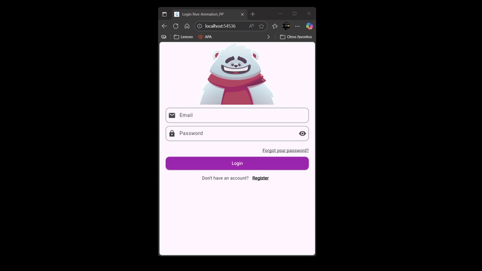

# 🦊 Animated Login Screen using Flutter + Rive (Proyecto piloto)

## ✨ Overview
This project showcases an **interactive animated login screen** built with **Flutter** and **Rive**.  
The animation reacts dynamically to user actions — the character looks around when typing, covers its eyes when entering the password, and responds with happy or sad animations depending on the validation results. 🎭

---

## 🎨 What is Rive?
**Rive** is a real-time interactive animation tool that lets designers and developers create complex animations that respond to **user input**, without exporting videos or spritesheets.  
It integrates directly with **Flutter**, allowing developers to control animations using **state machines** and **inputs** (e.g., booleans, numbers, triggers).

---

## 🧠 What is a State Machine?
A **State Machine** in Rive defines how an animation changes based on different states or events.  
Each state represents a visual behavior (e.g., idle, looking, covering eyes), and transitions between them occur when a variable (SMI – State Machine Input) changes in the code.

Example:
```dart
SMIBool? isChecking; // Triggers "looking" animation
SMIBool? isHandsUp;  // Triggers "cover eyes" animation
SMITrigger? trigSuccess; // Plays "happy" animation
SMITrigger? trigFail;    // Plays "sad" animation
```
---
## ⚙️ Features

👁️ Real-time animated reactions based on user focus and typing.

✅ Email and password validation with dynamic UI feedback.

🧠 Integration of Rive’s State Machine Controller.

⏱️ Debounce system to stop the character from "staring" after typing.

🧹 Proper resource management with dispose() to avoid memory leaks.

📱 Responsive design that adapts to different screen sizes.

---

## 🧩 Technologies Used
Tool / Library	Description\
Flutter 🐦	Framework for building cross-platform apps.\
Rive 🎞️	Animation engine for interactive graphics.\
Dart 💻	Programming language used by Flutter.\
Material Design 🎨	UI components and design guidelines from Google.

---

## 📁 Project Structure (Main Files in lib/)
```
lib/
├── main.dart                # Entry point of the application
├── login_screen.dart        # Main Login UI and logic
└── assets/
    └── animated_login_character.riv   # Rive animation asset
```
---
## 🧰 Key Code Snippets

### 🎯 Focus Detection

Detects when the user focuses on a text field and triggers the corresponding animation.

```dart
emailFocus.addListener(() {
  if (emailFocus.hasFocus) {
    isHandsUp?.change(false);
    numLook?.value = 50.0;
  }
});
```

### 👀 Eye Movement While Typing

Makes the character’s eyes follow the text input:

```dart
onChanged: (value) {
  isChecking?.change(true);
  final look = (value.length / 80.0 * 100.0).clamp(0.0, 100.0);
  numLook?.value = look;
}
```

### 🔒 Password Validation

```dart
bool isValidPassword(String pass) {
  final re = RegExp(
    r'^(?=.*[a-z])(?=.*[A-Z])(?=.*\d)(?=.*[^A-Za-z0-9]).{8,}$',
  );
  return re.hasMatch(pass);
}
```
---

## 🎥 Demo

Here’s how it looks in action! 👇


---

## 🖋️ Credits

🎨 Animation by: Rive Community / Original Creator’s Link

💡 Implementation and logic by: Abdiel Magaña

---

## 🧩 How to Run the Project

### Install Flutter SDK

```bash
flutter doctor
```

Make sure all dependencies are marked as ✅

### Get packages

```bash
flutter pub get
```

### Run the app

```bash
flutter run
```

---

## ⚠️ Common Setup Issues and Fixes (Java / Kotlin / Gradle)

Many classmates faced version-related errors when building or running the project.
Here are the most common problems and their solutions 👇

### 🧩 1. Java SDK Version Error

Error example:

```vbnet
Unsupported Java. 
Your build is currently configured to use Java 21.
```

✅ Fix:
Edit your gradle.properties or environment variables:

```propierties
org.gradle.java.home=C:\\Program Files\\Java\\jdk-17
```

Flutter currently works best with Java 17.

### 🧩 2. Kotlin Compatibility Issue

Error example:

```kotlin
Kotlin version is too low for this Android Gradle Plugin.
```

✅ Fix:
Update Kotlin to a compatible version (e.g., 1.9.0 or later).
Edit your project’s build.gradle file:

```gradle
plugins {
    id("org.jetbrains.kotlin.android") version "1.9.0" apply false
}
```

### 🧩 3. Gradle Plugin Update Error

Error example:

```pgsql
Plugin [id: 'com.android.application', version: '7.1.2'] was not found
```

✅ Fix:
Use a stable version supported by Flutter (for example, 7.4.2).
In android/build.gradle:

```gradle
dependencies {
    classpath "com.android.tools.build:gradle:7.4.2"
}
```

Then, sync again:

```bash
flutter clean
flutter pub get
```

### 🧩 4. Kotlin & Flutter Compatibility in settings.gradle.kts

Sometimes, the Flutter Gradle Plugin must be applied after Android and Kotlin plugins:

```kotlin
plugins {
    id("com.android.application")
    id("org.jetbrains.kotlin.android")
    id("dev.flutter.flutter-gradle-plugin")
}
```

This order ensures the Gradle configuration works properly when mixing Flutter and Kotlin.

### 🧩 5. Android SDK Path Not Found

Error example:

```pgsql
SDK location not found. Define a valid SDK location with an ANDROID_HOME variable.
```

✅ Fix:
Create or edit the file:

```php-template
C:\Users\<YourUser>\AppData\Local\Pub\Cache\hosted\<your_project>\android\local.properties
```

Add this line:

```properties
sdk.dir=C:\\Users\\<YourUser>\\AppData\\Local\\Android\\Sdk
```
----
